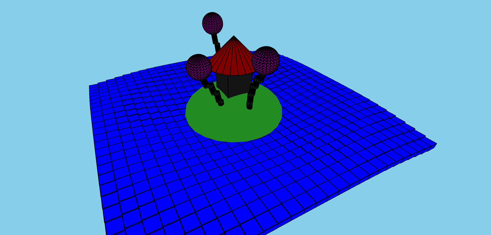

# Projeto Castelo
## README gerado pela mesma IA usada nos projetos ([PHIND](https://phind.com)).

Este projeto é uma aplicação web que fornece uma visualização interativa 3D de um castelo em uma ilha. A visualização é criada usando p5.js, uma biblioteca JavaScript para codificação criativa.

https://felpin007.github.io/Visualizacao-3D-Castelo/

## Recursos

- Visualização 3D de um castelo, ilha e mar.
- Controles de câmera interativos usando setas do teclado e arrasto do mouse.
- Ondas do mar dinâmicas e flores ao redor do castelo para realismo aprimorado.

## Como Executar

1. Abra o arquivo `index.html` no seu navegador web.
2. Use as setas do teclado para mover a câmera ao redor da cena.
3. Clique e arraste o mouse para girar a câmera.

## Tecnologias Utilizadas

- HTML
- JavaScript
- p5.js

## Arquivos

- `index.html`: O arquivo HTML principal que carrega o código JavaScript e a biblioteca p5.js.
- `script.js`: O arquivo JavaScript que contém o código p5.js para criar a visualização 3D.
